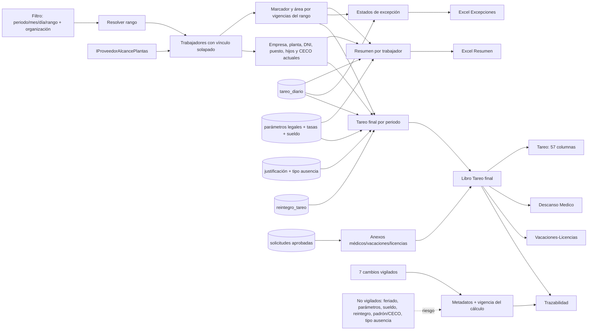

# D12 — Generación de reportes y Excel

```mermaid
flowchart LR
    F[Filtro: periodo/mes/día/rango + organización] --> RR[Resolver rango]
    RR --> POP[Trabajadores con vínculo solapado]
    SCOPE[IProveedorAlcancePlantas] --> POP
    POP --> HIST[Marcador y área por vigencias del rango]
    POP --> CUR[Empresa, planta, DNI, puesto, hijos y CECO actuales]

    TD[(tareo_diario)] --> SUM[Resumen por trabajador]
    HIST --> SUM
    CUR --> SUM
    PAR[(parámetros legales + tasas + sueldo)] --> SUM
    SUM --> XR[Excel Resumen]

    TD --> EX[Estados de excepción]
    HIST --> EX
    EX --> XE[Excel Excepciones]

    TD --> TF[Tareo final por periodo]
    HIST --> TF
    CUR --> TF
    PAR --> TF
    J[(justificación + tipo ausencia)] --> TF
    RE[(reintegro_tareo)] --> TF
    SA[(solicitudes aprobadas)] --> ANN[Anexos médicos/vacaciones/licencias]
    ANN --> BOOK
    TF --> BOOK[Libro Tareo final]
    BOOK --> H1[Tareo: 57 columnas]
    BOOK --> H2[Descanso Medico]
    BOOK --> H3[Vacaciones-Licencias]

    META[Metadatos + vigencia del cálculo] --> H4[Trazabilidad]
    BOOK --> H4

    CH[7 cambios vigilados] --> META
    OMIT[No vigilados: feriado, parámetros, sueldo, reintegro, padrón/CECO, tipo ausencia] -. riesgo .-> META
```

El reporte no recalcula. La hoja `Trazabilidad` advierte obsolescencia, pero la señal no cubre todos los insumos y compara contra el `CalculadoEn` máximo.
